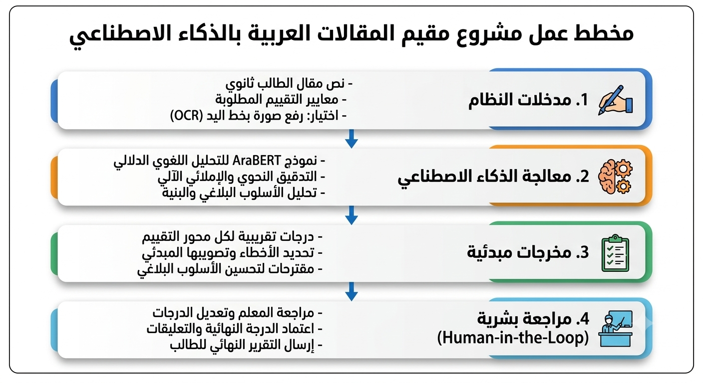

# AI Arabic Essay Evaluator
Building AI course project

## Summary
مشروع **AI Arabic Essay Evaluator** هو أداة ذكاء اصطناعي مخصصة لمعالجة اللغة العربية، تهدف إلى مساعدة معلمي اللغة العربية في تقييم المقالات والنصوص الأدبية وتصحيحها آلياً. توفر الأداة تحليلاً للبنية اللغوية، الأسلوب البلاغي، والأخطاء الإملائية والنحوية، مما يمنح المعلم تغذية راجعة سريعة ومقترحات للتصحيح.

## Background
* **المشكلة:** يواجه معلمو اللغة العربية (خاصة في المرحلة الثانوية) عبئاً زمنياً كبيراً في تصحيح مئات المقالات والإجابات الإنكشافية والتعبيرية يدوياً، مما قد يؤدي إلى الإرهاق وتأخر إرجاع التغذية الراجعة للطلاب.
* **مدى الانتشار:** هذه مشكلة واسعة الانتشار في كافة المؤسسات التعليمية والمدارس الثانوية والجامعات التي تدرّس اللغة العربية.
* **الدافع الشخصي:** الرغبة في تسخير تقنيات الذكاء الاصطناعي الحديثة لدعم اللغة العربية وتخفيف عبء التصحيح الروتيني عن المعلمين، ليتفرغوا للجانب التربوي والتفاعلي مع الطلاب.
* **أهمية الموضوع:** اللغة العربية لغة غنية بالأساليب البلاغية والتركيبية، والأدوات الحالية للذكاء الاصطناعي غالبًا ما تركز على اللغة الإنجليزية، لذا فإن تطوير أدوات مخصصة للغة العربية يُعد خطوة مهمة لخدمة التعليم العربي.

## How is it used?
* **سياق الاستخدام:** يُستخدم التطبيق عبر منصة ويب بسيطة على الكمبيوتر أو اللوح الرقمي، حيث يقوم المعلم بترشيح أو رفع نصوص مقالات الطلاب.
* **المستخدمون:** معلمو اللغة العربية في المدارس ومصححو الامتحانات.
* **احتياجات المستخدمين:** سرعة المعالجة، وضوح التغذية الراجعة، وإمكانية تعديل التقييم اليدوي عند الحاجة.

## Data sources and AI methods
* **مصادر البيانات:**
  * مجموعات بيانات مفتوحة المصدر للنصوص العربية المقيمة مسبقاً (مثل [Arabic Learner Corpus](https://arabiclearnercorpus.com/)).
  * نصوص ومقالات تم إعدادها بالتعاون مع معلمي لغة عربية لتدريب النموذج على معايير التقييم.
* **تقنيات الذكاء الاصطناعي:**
  * معالجة اللغة الطبيعية (NLP).
  * نماذج المحولات المتطورة والمخصصة للغة العربية مثل **AraBERT** أو **MARBERT** للتحليل الدلالي والنحوي وتوليد الملاحظات التقييمية.

## Challenges & Solutions (التحديات والعقبات وكيفية تجاوزها)

| التحدي / العقبة (Challenge) | الحل المقترح لتجاوزه (Solution) |
| :--- | :--- |
| **صعوبة فهم البلاغة والتذوق الأدبي:** صعوبة تقييم الصور البيانية والمحسنات البديعية بدقة مقارنة بالحس البشري. | **الاعتماد على التقييم المزدوج (Human-in-the-Loop):** استخدام النموذج كـ "مساعد معلم" يقدم اقتراحات أولية، مع إبقاء القرار النهائي في الدرجة للمعلم. |
| **تعقد قواعد النحوي والإعراب العربي:** كثرة الاستثناءات والحالات النحوية المركبة في اللغة العربية. | **استخدام نماذج لغوية متخصصة:** اعتمادات نماذج مدربة خصيصاً على معالجة اللغة العربية مثل `AraBERT` وتغذيتها بقواعد النحو والتصريف (`Morphological Analyzers`). |
| **خط اليد غير الواضح في الإجابات الورقية:** صعوبة تحويل صور الورق المكتوب بخط اليد إلى نصوص رقمية بدقة. | **دمج تقنيات التعرف الضوئي المتقدمة (OCR):** استخدام خوارزميات التعلم العميق المخصصة لقراءة الخطوط العربية اليدوية قبل إرسال النص إلى نموذج التقييم. |
| **مخاطر التحيز في الدرجات (Model Bias):** احتمال منح النموذج درجات غير عادلة بناءً على أسلوب معين. | **التدريب على بيانات متنوعة ومراجعة دورية:** استخدام مجموعة بيانات واسعة من مختلف المدارس والمستويات وإجراء معايرة مستمرة للتنبؤات. |

## What next?
* **التوسع:** تطوير تطبيق هاتف يدعم تقنية التعرف الضوئي على الحروف (OCR) لقراءة المقالات المكتوبة بخط اليد وتصحيحها مباشرة من الصور.
* **الاحتياجات المستقبليّة:** التعاون مع مطوري نماذج اللغة العربية وجمع المزيد من البيانات التعليمية الموثوقة لرفع دقة النموذج.

## Acknowledgments
* مستوحى من أدوات معالجة اللغة الطبيعية المفتوحة المصدر المخصصة للغة العربية مثل AraBERT.
* الصورة المستخدمة في الشرح: [Arabic Alphabet Wiki](https://commons.wikimedia.org/wiki/File:Arabic_alphabet_official_languages.svg) / [CC BY-SA 3.0](https://creativecommons.org/licenses/by-sa/3.0/).
* تم إعداد هذا المخطط كجزء من المشروع النهائي لدورة **Building AI** المقدمة من جامعة هلسنكي و Reaktor.
